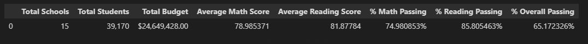
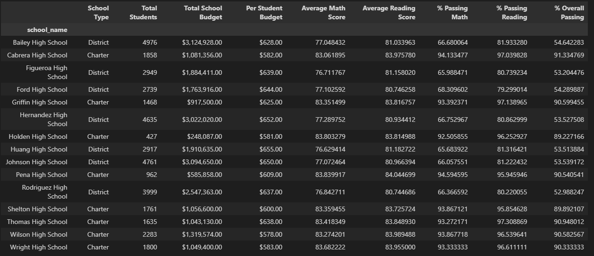
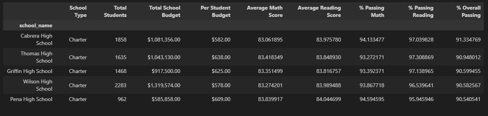
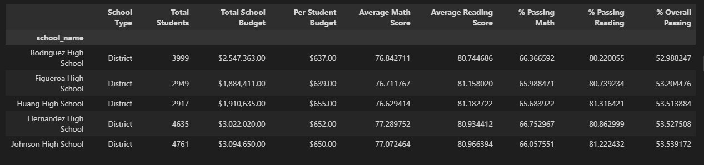
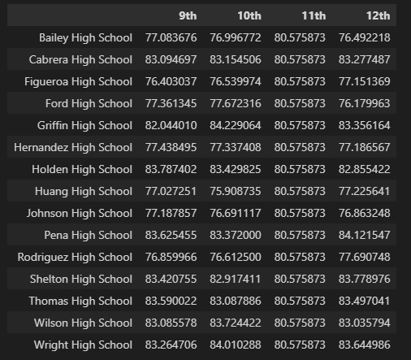
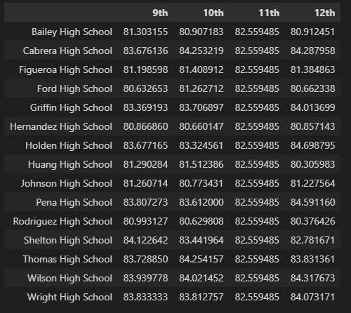
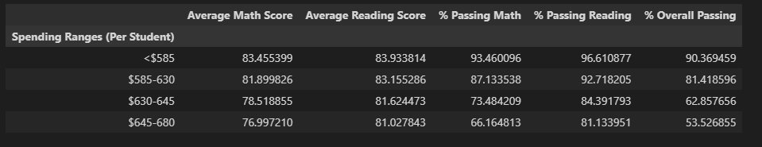
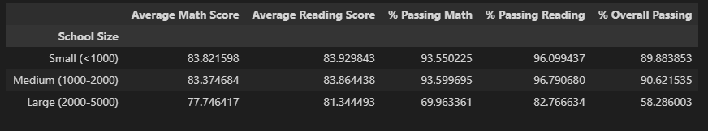
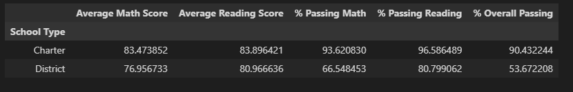

# Analysis of School District Data

Aim of this analysis is to see the trends of standardized test scores among different schools in a specific district. This project will help the authorities to understand the reasons behind the successes/failures of different schools and act accordingly in the future. 

There are two data sets, which are 'schools data' and 'students data'. Before starting analysis, these two datasets were merged.  

This school district has 15 schools (7 district public, 8 charter) and 39,170 students who are attending to these schools. The school district has total budget of $24,649,428. 

## Trends

* District summary table shows that average reading test scores are higher than average math scores.  
* There is negative relationship between test scores and school budgets.
* There is negative relationship between test scores and school size.
* Charter Schools have higher average test scores than distict public schools in all metrics. 

## Analysis
### District Summary

Dataframe includes:

* Total schools
* Total students
* Total budget
* Average math score
* Average reading score
* % passing math (the percentage of students who passed math)
* % passing reading (the percentage of students who passed reading)
* % overall passing (the percentage of students who passed math AND reading)

### School Summary

Data Frame includes below key metrics about each school:

* School name
* School type
* Total students
* Total school budget
* Per student budget
* Average math score
* Average reading score
* % passing math (the percentage of students who passed math)
* % passing reading (the percentage of students who passed reading)
* % overall passing (the percentage of students who passed math AND reading)

### Highest-Performing Schools (by % Overall Passing)

DataFrame highlights the top-5 performing schools based on % Overall Passing. Includes the following metrics:

* School name
* School type
* Total students
* Total school budget
* Per student budget
* Average math score
* Average reading score
* % passing math (the percentage of students who passed math)
* % passing reading (the percentage of students who passed reading)
* % overall passing (the percentage of students who passed math AND reading)

### Lowest-Performing Schools (by % Overall Passing)

DataFrame highlights the bottom-5 performing schools based on % Overall Passing. Includes the following metrics:

* School name
* School type
* Total students
* Total school budget
* Per student budget
* Average math score
* Average reading score
* % passing math (the percentage of students who passed math)
* % passing reading (the percentage of students who passed reading)
* % overall passing (the percentage of students who passed math AND reading)

### Math Score by Grade

This dataframe lists the average math score for students of each grade level (9th, 10th, 11th, 12th) at each school.

### Reading Score by Grade

This dataframe lists the average reading score for students of each grade level (9th, 10th, 11th, 12th) at each school.

### Scores by School Spending

This dataframe breaks down school performance based on average spending ranges (per student) and includes the following metrics:

* Average math score
* Average reading score
* % passing math (the percentage of students who passed math)
* % passing reading (the percentage of students who passed reading)
* % overall passing (the percentage of students who passed math AND reading)

### Scores by School Size

This table breaks down school performance based on school size (small, medium, or large).

### Scores by School Type

This table breaks down school performance based on school type (district public or charter)

